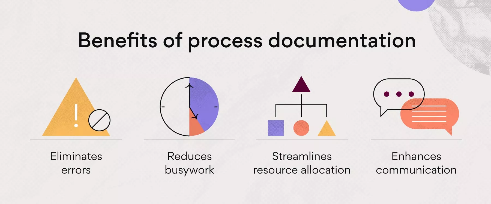
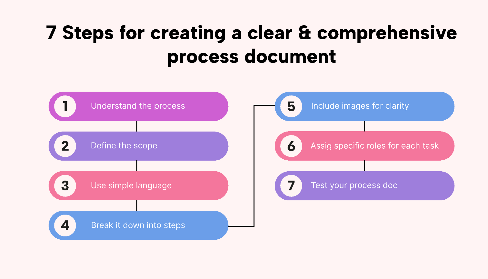

# dgl104-programming-article-repo

**Documentation Processes**

**Introduction**
    Documentation is the act of recording important details in paper or digitally for future reference. Clear and detailed documentation explains things clearly and saves time. Documentation is necessary for productive work and clear communication in today's world. It keeps all the important and essential information secure and accessible. It benefits various sectors like businesses, IT teams, and healthcare by enhancing job tracking and project management. Well-structured documentation, whether it be a project document, report, or manual, improves productivity and reduces errors. It also boosts productivity, improves teamwork, and can help in training new hires. Poor documentation leads to inefficiency, mistakes and confusion that consumes time.

    This article discusses the benefit of documenting, effective documentation techniques, and beneficial tools.

**Why Documentation Is Needed:**
1. **Saves and Shares Information**
     Documentation keeps important information safe so that people can find and use it in the future. It helps in the onboarding of new team members by providing them with essential information and historical context, thus maintaining continuity in operations (Smith, 2021). It increases learning and knowledge transfer within the organization.
2. **Helps Follow Standards/Rules**
    Various fields, like software, healthcare and finance, are subjected to strict rules. They can remain out of difficulties and stay within the law with proper documentation (Jones & Taylor, 2020). Clear guidelines ensure that everyone follows the same procedures, which is crucial for quality control and maintaining standards across projects.
3. **Increases Efficiency**
    Individuals who have clear documentation finish their work faster because they can refer to documentation without asking questions, which saves time for both the person asking and the person who would have to respond. This effectiveness can end up in faster work completion. (Brown, 2019).
4. **Reduces Mistakes**
    People are less likely to make mistakes when processes are properly documented. Proper documentation explains the correct way of doing things (Miller, 2022).

**How to Create Good Documentation**
1. **Know Your Audience**
    Consider your readers' background and needs before you begin writing. Software employees documentation will be quite distinct from end-user or the client documentation. Adjust your technical aspects, terminology, and extent of detail depending on the situation (Johnson, 2018).
2. **Keep It Simple and Clear**
    Use simple, short and straightforward sentences when writing. Mostly avoid difficult words unless your audience is familiar with it from the business. Making the documentation both user-friendly and informative is the end goal. (Williams, 2020).
3. **Organize and Update**
    Use headings, bullet points, Images, flowcharts, tables to make information simpler for readers (Clark & Patel, 2019). Old data might be false and misleading. Update documents frequently for optimal accuracy (Davis, 2021). 
4. **Use Pictures and Videos**
    Diagrams, pictures, and videos can help in conveying concepts better than words alone.
5. **Tools for documentation**
    There are various tools that make documenting easier, like:
    ●  	Confluence is a tool that allows teams to write and share documents.
    ●	Google Docs is a simple online document editor.
    ●	Markdown is a text formatting method that allows for a clear structure.
    ●	Doxygen - A software documentation tool.

6. **Keep Track of Changes**
    Using version control systems such as Git allows you to track content updates and avoid losing important adjustments.
7. **Ask for Feedback**
    Provide options for viewers or readers like the comments section to provide their opinion or ask for doubts. That helps in improving the documentation content more helpful for everyone. People using the documentation can help improve it by pointing out mistakes or unclear sections (Baker, 2021).

**Documentation in Different Fields**
1. **Software Organizations**
    Examples: User manuals, API documentation, code comments, development guides, and release notes. Open-source projects keep their documentation on sites like GitHub or GitLab, allowing for community contributions and version control, letting developers across the world contribute and view project details. Code comments are inline explanations within source code for clarity, whereas API documentation are extensive recommendations on how to use software interfaces and ensure that other developers may properly connect with the software. 
    It maintains a format and includes Introduction, Abstract, Code Blocks, Steps of project flow, Testing, conclusion etc

2. **Healthcare**
    Examples: Patient records, medical guidelines, compliance reports,prescription histories Hospitals utilize Electronic Health Records (EHR) systems to store and manage patient history, ensuring seamless access to patient information across different healthcare providers.
3. **Business**
    Examples: Company policies,rules and regulations, monthly and yearly financial reports. Financial reports provide insights into the company's financial health.
4. **Education**
    Examples: Students details, Marks, Course details, Syllabus, lesson plans, accreditation reports. Lesson plans are used to structure class schedules, while accreditation reports verify that educational institutions satisfy the required criteria.  

    
    

**Challenges in Documentation**
1. **Consistency and Standardization**
    Inconsistent methods of documentation may result in confusion and inefficiency. Setting standardized templates, standards and formats for documentation can help to encourage uniformity and clarity. This approach helps team members stick to the same procedures, boosting teamwork and removing misunderstandings. Establishing a process for regular reviews and updates makes sure the documents are current and reliable.
2. **Time and Resources**
    Many organizations aren't giving enough time and resources to documentation, resulting in incomplete Information. This might decrease productivity and cause confusion (Johnson, 2018). 
3. **Resistance to Documentation**
    Individuals may see documentation as an added burden and avoid it. Creating a culture that acknowledges documentation and highlights its advantages can help to overcome this barrier (Clark & Patel, 2019). Training and demonstrating the long-term benefits of thorough documentation may encourage employees to adopt this practice. 
4. **Managing Large Documents**
    Big projects can have more information to document, making it hard to manage. This needs more resources and frequent updates may consume time (Davis, 2021). Utilizing document management tools makes the process easier. 
5. **Keeping Information Secure**
    Sensitive documents should be protected with passwords and security settings to prevent unauthorized access (Miller, 2022).

**Conclusion**
    Effective documentation is necessary for individuals to track key information, improve efficiency, and reduce errors. Documentation that is structured correctly, and updated on a regular basis improves productivity and facilitates cooperation. The main benefits include retention of information, legal compliance, reduction in time, and consistent practices. To optimize these benefits, keep your work up to date, apply clear formats, set security measures in place, and encourage user input. Using current documentation technologies improves management and readability. With the correct methods, documentation may be made into a valuable asset that promotes overall performance and allows for smooth operations in various kinds of fields.

**References**
    ●	Baker, T. (2021). Improving Documentation Strategies for Better Communication. Oxford Press.
    ●	Brown, R. (2019). Efficiency Through Documentation: A Guide for Organizations. Harvard Business Review.
    ●	Clark, S., & Patel, R. (2019). Structured Documentation in Business Processes. McGraw-Hill.
    ●	Davis, K. (2021). Managing Large-Scale Documentation Projects. Pearson.
    ●	Henderson, L. (2019). Visual Aids in Technical Writing. Wiley & Sons.
    ●	Johnson, P. (2018). Overcoming Resistance to Documentation in Workplaces. Cambridge University Press.
    ●	Jones, M., & Taylor, B. (2020). Regulatory Compliance Through Effective Documentation. Springer.
    ●	Miller, D. (2022). Risk Management and Documentation Best Practices. Routledge.
    ●	Nelson, J. (2020). Version Control and Documentation in Software Development. ACM Publications.
    ●	Smith, K. (2021). Knowledge Management in the Digital Age. MIT Press.
    ●	TechRadar. (2022). Top Documentation Tools for Professionals. Retrieved from https://www.techradar.com/best/documentation-tools
    ●	Williams, A. (2020). Simplifying Technical Documentation for Broader Audiences. Stanford University Press.